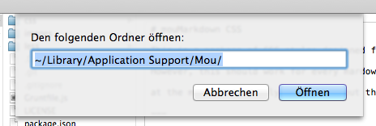
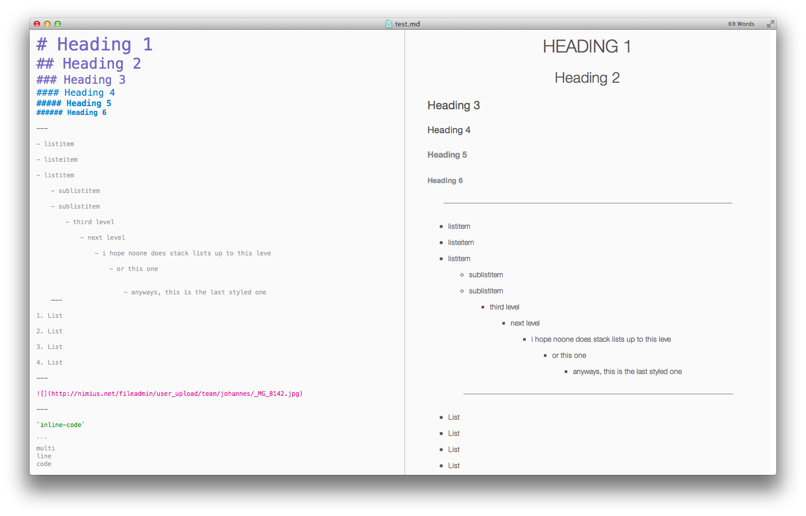
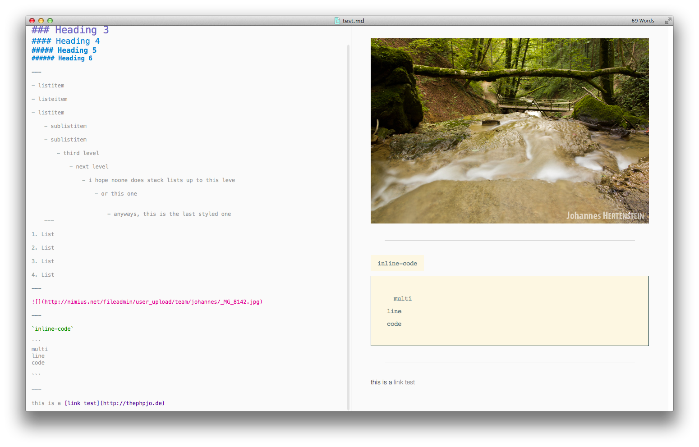
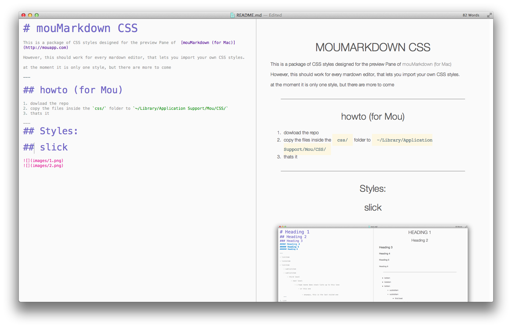
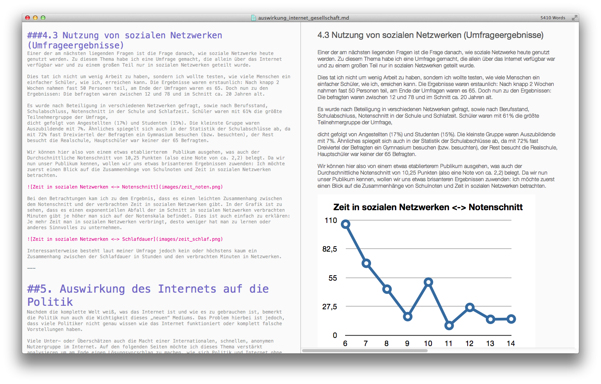

# mouMarkdown CSS

This is a package of CSS styles designed for the preview Pane of  [mouMarkdown (for Mac)](http://mouapp.com)

However, this should work for every mardown editor, that lets you import your own CSS styles.

at the moment it is only one style, but there are more to come

---

## howto (for Mou)

1. dowload the repo
2. copy the files inside the `css/` folder to `~/Library/Application Support/Mou/CSS/`
3. thats it

### Protip:
by pressing [shift][cmd][G] in the Finder, you can paste in a path and Finder will jump to that path




```
In case you don't know:
the tilde key (~) stands for your homefolder (e.g. /Users/thephpjo/)
so you have to copy the files /Users/{$yourUser}/Library/Application Support/Mou/CSS/
```

---
## Styles:

## slick




